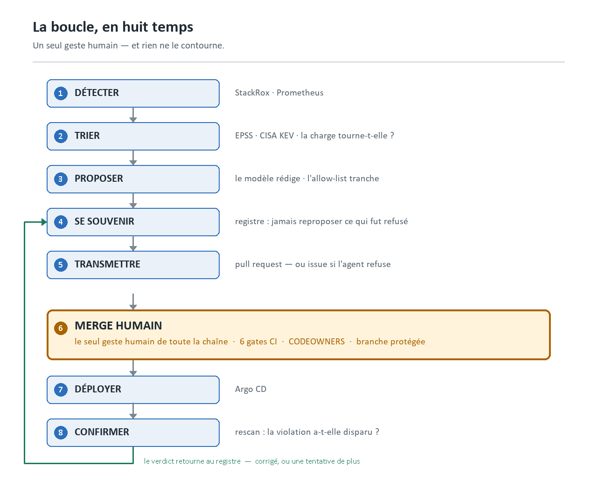
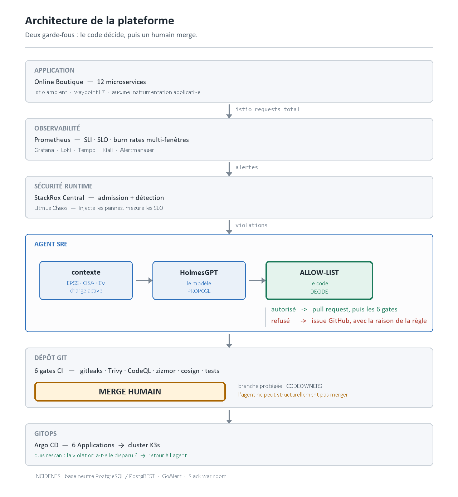
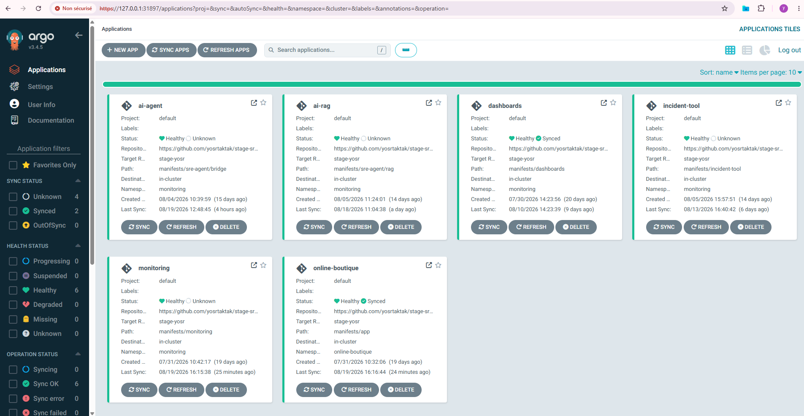
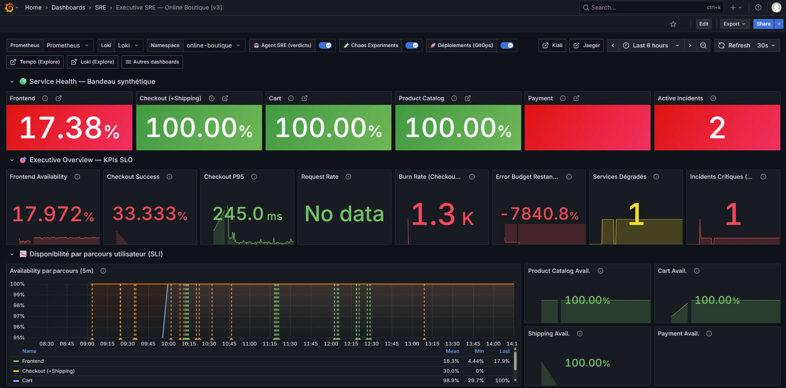
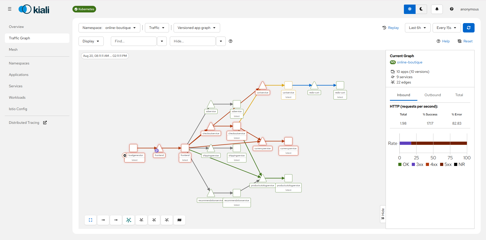
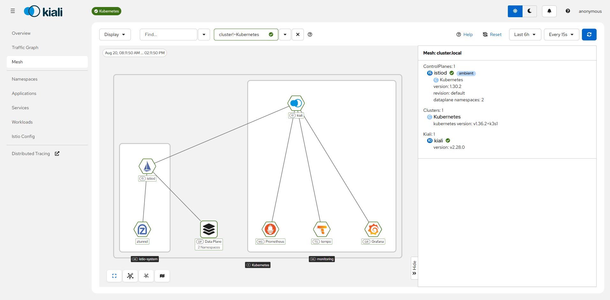
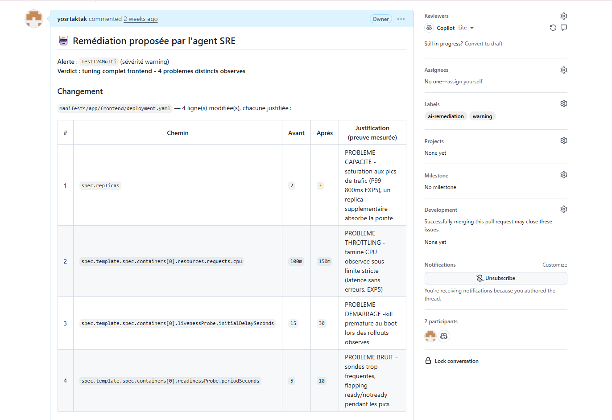
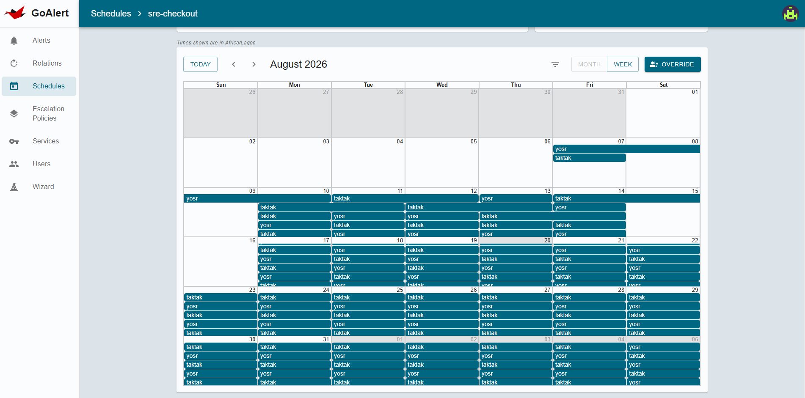
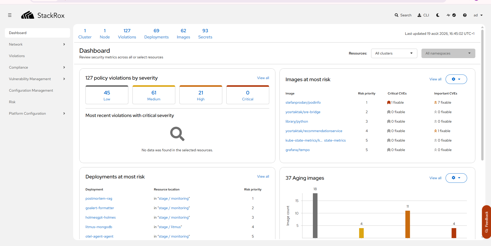
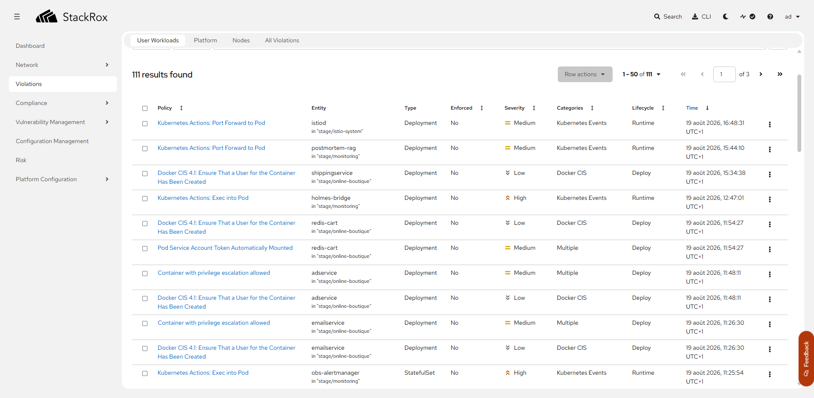

  <p align="center"><b>Plateforme SRE — Online Boutique</b></p>

  Ce dépôt est un fork d'[Online Boutique](https://github.com/GoogleCloudPlatform/microservices-demo)
  (Google, Apache 2.0), enrichi d'une plateforme SRE complète : observabilité avec
  SLO mesurés, GitOps, chaos engineering, chaîne DevSecOps et agent de remédiation
  autonome.

  Le code applicatif d'origine est **inchangé**. Sa documentation est conservée
  intégralement dans la seconde partie de ce document.

  | | |
  |---|---|
  | 🛠 **[Partie I — La plateforme SRE](#plateforme-sre--observabilité-chaos-engineering-et-devsecops)** | ce qui a été ajouté : architecture, agent,
  pipeline, exploitation |
  | 🛒 **[Partie II — Online Boutique](#online-boutique--documentation-dorigine-google)** | la documentation d'origine de Google, intacte |

  ---
# Plateforme SRE — observabilité, chaos engineering et DevSecOps

> Ce dépôt est un fork de [Online Boutique](https://github.com/GoogleCloudPlatform/microservices-demo)
> (Google, Apache 2.0). Le code applicatif d'origine — `src/`, `helm-chart/`,
> `kubernetes-manifests/`, `kustomize/`, `terraform/` — est **inchangé** et reste
> documenté par le [README d'origine](README.md).
>
> Ce document décrit la plateforme construite **autour** de cette application :
> observabilité, GitOps, chaos engineering, chaîne DevSecOps et agent de
> remédiation. Tout cet ajout vit dans `manifests/`, `.github/` et
> `docs/plateforme/`.

---

## 1. En une phrase

Une application de démonstration transformée en **banc d'essai SRE complet** :
douze microservices instrumentés avec des SLO mesurés, déployés en GitOps,
soumis à des expériences de chaos, protégés par une chaîne DevSecOps à six
étages, et supervisés par un agent qui ne se contente pas de diagnostiquer — il
ouvre la pull request qui corrige.

## 2. La pile

| Domaine | Outils |
|---|---|
| **Orchestration** | K3s (mono-nœud), Istio en mode *ambient* |
| **Observabilité** | Prometheus, Grafana, Loki, Tempo, Alertmanager, Kiali |
| **GitOps** | Argo CD — 6 Applications, synchronisation automatique |
| **Chaos engineering** | Litmus Chaos |
| **Sécurité runtime** | StackRox / Central — admission et détection |
| **Sécurité CI** | Trivy, gitleaks, CodeQL, zizmor, Renovate |
| **Chaîne d'approvisionnement** | SBOM SPDX, cosign *keyless* (signature + attestation sur digest) |
| **Gestion d'incidents** | GoAlert, base neutre PostgreSQL/PostgREST, Mailpit, Slack |
| **Agent** | HolmesGPT, Gemini / Groq en repli, RAG vectoriel Qdrant |

Le code de l'agent est en **Python standard uniquement** — aucune dépendance
tierce. La surface de vulnérabilité se réduit donc à l'image de base, tenue à
jour par Renovate.

## 3. Architecture

### La boucle, en six temps



Le seul point jaune est le seul moment où un humain intervient. Tout le reste
est automatique — et rien ne franchit ce point sans lui.

### Vue d'ensemble



### Les six Applications Argo CD

| Application | Chemin synchronisé | Contenu |
|---|---|---|
| `online-boutique` | `manifests/app` | les charges applicatives et le mesh |
| `monitoring` | `manifests/monitoring` | Prometheus, Grafana, Loki, Tempo |
| `dashboards` | `manifests/dashboards` | les tableaux de bord Grafana |
| `sre-agent` | `manifests/sre-agent/bridge` | l'agent et sa passerelle |
| `ai-rag` | `manifests/sre-agent/rag` | la mémoire vectorielle des incidents |
| `incident-tool` | `manifests/incident-tool` | GoAlert, base d'incidents, relais mail |

Les définitions d'Application vivent dans `manifests/argoCD/app/` et sont
appliquées manuellement — c'est le point d'amorçage de la plateforme.


*Les six Applications, toutes `Healthy`. Chacune pointe une branche unique du
dépôt : l'état du cluster est entièrement dérivé de Git.*

### Mesure de la fiabilité

Les SLI sont mesurés par le **waypoint Istio**, pas par l'application : aucune
instrumentation applicative n'est nécessaire, et la mesure reste valable si le
code change.

| SLO | Objectif |
|---|---|
| `checkout_success` | 99,95 % |
| `frontend_availability` | 99,9 % |
| `productcatalog`, `cart` | 99 % |
| `user_journey` | 99,5 % — le produit des quatre maillons |

Des *recording rules* Prometheus calculent les **burn rates multi-fenêtres**
(5 min / 1 h), et c'est leur franchissement qui déclenche les alertes — pas un
seuil d'erreur brut. Le budget d'erreur restant est exposé et suivi.


*Le tableau de bord « Executive SRE », pendant un incident réel. La
disponibilité du frontend est tombée à **17,38 %**, le burn rate à **1,3 k**, et
le budget d'erreur est épuisé. Les barres verticales du graphe du bas sont les
annotations automatiques : orange pour les expériences de chaos et les
déploiements GitOps, verte pour chaque verdict rendu par l'agent — on lit
directement quelle action a précédé quelle dégradation.*


*Le même incident vu par le mesh : 10 applications, 9 services, 22 liens, et un
taux d'erreur de **82,83 %** sur le trafic entrant. Les arêtes rouges tracent le
chemin de la panne depuis le `loadgenerator` jusqu'aux services de paiement et
de devise.*


*Le plan de contrôle : `istiod` en mode **ambient** (pas de sidecar), `ztunnel`
sur le plan de données, et les trois consommateurs de télémétrie. C'est ce mode
qui permet de mesurer les SLI sans instrumenter une seule ligne applicative.*

## 4. L'agent de remédiation

### Le principe

> **Le modèle de langage propose. Le code décide.**

Le LLM fait ce qu'il fait bien : lire un contexte hétérogène — une alerte, des
logs, des métriques, l'historique des déploiements, un manifeste — et raconter
ce qui se passe. À la fin de son diagnostic, il écrit un bloc structuré :
« changer ce champ, de cette valeur à celle-là, pour cette raison ».

Ensuite **il n'a plus la main**. Du code Python, sans aucune IA, confronte la
proposition à une allow-list écrite en dur :

- ce fichier est-il modifiable ? *(une expression régulière, pas une consigne)*
- ce champ est-il modifiable ?
- la valeur est-elle dans les bornes ? *(`replicas` entre 1 et 5, jamais 0 —
  sinon une PR parfaitement plausible éteindrait le service)*
- la valeur actuelle dans le dépôt correspond-elle à ce que l'agent croit ?
  *(sinon il raisonne sur un état périmé, on abandonne)*

Ce qui ne passe pas devient une recommandation Slack ou une issue.

La raison d'être de cette architecture tient en une phrase : **un LLM peut
désobéir à une consigne écrite dans un prompt, jamais à une expression régulière
écrite dans du code.**

### Deux frontières infranchissables

L'agent modifie les manifestes applicatifs. Il ne peut pas toucher à
`manifests/sre-agent/` — ses propres garde-fous — ni à `.github/` — les workflows
qui contrôlent ses propositions. Une pull request intitulée « réduire les
permissions du workflow » désarmerait exactement le contrôle qui s'exerce sur
elle, et elle aurait l'air d'une amélioration.

Le pendant existe côté cluster : le jeton de l'agent auprès de StackRox est en
lecture seule. Il lit le contexte d'exécution pour trancher, il ne peut pas
reconfigurer l'outil qui le surveille.

### Le tri : pourquoi celle-ci plutôt qu'une autre

« CRITICAL » ne veut rien dire seul. Avant d'appeler le modèle, l'agent collecte
trois signaux et les injecte comme faits acquis :

| Source | Question à laquelle elle répond |
|---|---|
| **EPSS** (FIRST.org) | quelle probabilité d'exploitation à 30 jours ? |
| **CISA KEV** | cette faille est-elle exploitée **en réel**, aujourd'hui ? |
| **API Central** | cette image tourne-t-elle encore ? est-elle exposée ? |

Le contexte d'exécution peut **déclasser**, jamais surclasser : une CVE sur une
image qui ne tourne plus devient un sujet de documentation, pas une urgence. Et
seul CISA KEV autorise une escalade immédiate vers l'astreinte.

Si l'une de ces sources est injoignable, le verdict sort quand même, avec la
mention explicite des sources manquantes. Un agent qui se tait parce qu'une API
tierce est en panne est pire qu'un agent approximatif.

C'est ce qui distingue le corps d'une pull request de l'agent de celui d'un
Renovate : Renovate dit « une version plus récente existe », l'agent dit
**pourquoi celle-ci est urgente**, avec ses sources.


*Une pull request réelle. Quatre lignes modifiées dans un seul fichier, et
**chacune porte sa propre justification mesurée** : saturation aux pics pour la
réplique supplémentaire, famine CPU pour les ressources, redémarrage prématuré
pour le délai de sonde, flapping pour la période de vérification. Un correctif
groupé reste lisible ligne à ligne — c'est la condition pour qu'un humain puisse
le relire vite et le merger en confiance.*

### Ce qu'il sait corriger

**Réglages de production** — sondes de vivacité et de disponibilité, ressources
CPU/mémoire, nombre de répliques, délai d'arrêt gracieux, cadence de rollout,
fenêtre de progression. Jusqu'à cinq changements par pull request, tous dans le
même fichier, chacun justifié par une preuve mesurée.

**Références d'image** — épinglage d'un tag flottant sur une version concrète,
bump de patch, bump mineur, rafraîchissement de digest.

**Durcissement de conteneur**, par insertion **strictement additive** — jamais de
modification d'une valeur existante : `allowPrivilegeEscalation: false`,
`seccompProfile: RuntimeDefault`, `capabilities: drop [ALL]`.

**Retour arrière** — revert d'un commit corrélé à une dégradation.

### Ce qu'il refuse — et c'est délibéré

Bump majeur · downgrade · changement de dépôt ou de registre · perte d'un digest
· changement de variante · `drop ALL` sur un conteneur qui écoute sous le port
1024 · `readOnlyRootFilesystem` (aucune lecture statique ne dit où un programme
écrit) · `runAsNonRoot` sans preuve que l'image ne tourne pas en root.

Chacun de ces refus part en **issue**, avec la raison écrite par la règle qui a
refusé. Le travail d'analyse n'est jamais perdu.

### Ce qui le rend supportable

Un agent qui propose sans mesure devient un agent qu'on ignore. Trois mécanismes
l'évitent :

**La mémoire.** Un registre persistant distingue *le problème* de *ce qui a été
proposé pour lui*. Un refus humain porte sur la proposition : une autre version
mérite d'être soumise. Mais après deux refus sur le même problème, l'agent
abandonne — le désaccord ne porte plus sur la version, insister serait du
harcèlement automatisé.

**Le plafond.** Une file de quarante pull requests de sécurité vaut zéro pull
request. Au-delà d'un seuil, on ne protège plus, on noie la revue.

**La boucle fermée.** Après le merge et la synchronisation, l'agent **re-scanne** :
la violation a-t-elle réellement disparu ? Si oui, le problème est clos et
l'écart avec la proposition donne le temps de correction. Si non, il compte une
tentative — et la boucle reste bornée. Si la mesure est impossible, il ne marque
**rien** : un échec de mesure n'est pas un succès.

### Modules

Le code vit dans `manifests/sre-agent/bridge/src/`. Chaque module **décide** sans
écrire ; toute écriture est concentrée dans un seul endroit. Le réseau est
injecté, ce qui rend l'ensemble testable sans cluster, sans dépôt et sans
Internet — **183 tests**, aucun n'ouvre de connexion.

| Module | Rôle |
|---|---|
| `holmes-bridge.py` | orchestration : alertes, prompt, publication, métriques |
| `security_context.py` | tri EPSS / CISA KEV / contexte d'exécution |
| `security_rules.py` | ce qu'on a le droit de changer sur une référence d'image |
| `hardening_rules.py` | durcissement additif du `securityContext` |
| `findings_ledger.py` | mémoire des propositions et portes de sortie |
| `remediation.py` | allow-list, bornes, écriture et ouverture de pull request |
| `escalation.py` | ce qui demande un arbitrage humain part en issue |
| `rescan.py` | vérification post-déploiement, mesure du délai de correction |
| `incident_adapter.py` | cycle de vie des incidents dans une base neutre |
| `stackrox_adapter.py` | traduction des violations StackRox en alertes |

## 5. Gestion d'incidents sans dépendance à un outil

Le cycle de vie des incidents — ouverture, acquittement, clôture, chronologie —
est écrit dans une **base PostgreSQL neutre** exposée par PostgREST, jamais dans
l'API d'un outil d'astreinte. Le bridge ne connaît que des verbes standards.

GoAlert est donc remplaçable sans toucher à une ligne de l'agent, et les
indicateurs (délai d'acquittement, délai de résolution) restent calculables quel
que soit l'outil du moment. Un canal Slack dédié reflète chaque événement de la
chronologie : c'est la salle unique où convergent Alertmanager, l'agent et les
humains.


*Le planning d'astreinte du service `sre-checkout`. GoAlert gère les rotations
et les politiques d'escalade, mais **il ne détient pas la vérité** : le cycle de
vie des incidents vit dans la base neutre, ce qui rend l'outil remplaçable sans
toucher à l'agent.*

## 6. La chaîne DevSecOps

Six workflows, dont quatre gates armés qui bloquent le merge.

| Workflow | Contrôles |
|---|---|
| `security-scan` | gitleaks sur **tout l'historique**, Trivy config (misconfigs K8s), Trivy fs (CVE corrigeables), SBOM SPDX, zizmor sur les workflows, radar des findings HIGH |
| `validate-manifests` | chaque kustomization se rend, chaque manifeste valide son schéma |
| `agent-ci` | ruff + les 183 tests de l'agent |
| `build-images` | build, scan Trivy, SBOM, **cosign keyless** sur le digest |
| `codeql` | analyse statique du code Python |
| Renovate | mises à jour de dépendances, majeurs sous approbation explicite |

Trois principes appliqués :

**Les images sont signées sur leur digest, jamais sur leur tag.** Un tag est
mutable, un digest ne l'est pas.

**Les exceptions sont datées et justifiées.** Un fichier d'exceptions Trivy dont
chaque ligne porte un identifiant et une justification datée, plus un contrôle
automatique qui détecte celles devenues sans objet — une exception qu'on
n'enlève jamais est une porte laissée ouverte.

**Les actions sont épinglées par empreinte**, pas par tag mouvant.

### La détection en conditions réelles


*L'état de sécurité du cluster : **127 violations de politique** — 45 basses,
61 moyennes, 21 hautes, aucune critique — sur 69 déploiements et 62 images.
C'est ce volume qui rend l'automatisation nécessaire : personne ne traite
127 findings à la main, et c'est exactement pour cette raison qu'ils ne sont
jamais traités.*


*Le détail des violations. Trois familles dominent, et elles se traitent
différemment : `Container with privilege escalation allowed` part en pull
request automatique (le manifeste suffit à décider) ; `Docker CIS 4.1 — a User
for the Container Has Been Created` part en issue (la réponse est dans l'image,
pas dans le manifeste) ; `Pod Service Account Token Automatically Mounted`
demande une insertion au niveau du pod, hors du périmètre actuel de l'agent.*

## 7. Chaos engineering

Les expériences Litmus (`manifests/chaos/`) provoquent délibérément des pannes —
saturation mémoire, suppression de pod, latence réseau — pendant que les SLO
sont mesurés. Chaque expérience est annotée sur les tableaux de bord Grafana, ce
qui permet de lire directement l'effet sur le budget d'erreur.

C'est aussi le banc d'essai de l'agent : ses diagnostics sont confrontés à une
cause racine connue d'avance.

## 8. Documentation

| Pour… | Voir |
|---|---|
| déployer sur un cluster neuf | [`docs/plateforme/demarrage.md`](docs/plateforme/demarrage.md) |
| comprendre les composants | [`docs/plateforme/architecture.md`](docs/plateforme/architecture.md) |
| comprendre les gates | [`docs/plateforme/pipeline-devsecops.md`](docs/plateforme/pipeline-devsecops.md) |
| comprendre l'agent en détail | [`docs/plateforme/agent.md`](docs/plateforme/agent.md) |
| exploiter au quotidien | [`docs/plateforme/exploitation.md`](docs/plateforme/exploitation.md) |
| gérer accès et secrets | [`docs/plateforme/secrets.md`](docs/plateforme/secrets.md) |
| connaître les limites | [`docs/plateforme/limites.md`](docs/plateforme/limites.md) |

## 9. État de la plateforme

Ce qui suit est vérifié, pas déclaratif.

**Fonctionne de bout en bout.** Une violation de configuration détectée par
StackRox traverse toute la chaîne jusqu'à un manifeste corrigé en production,
sans autre intervention humaine que le merge.

**Points ouverts, par ordre de priorité.**

- **La CI est écrite en GitHub Actions.** Sur GitLab, elle doit être portée
  (`.gitlab-ci.yml`) — sans quoi aucun gate ne s'exécute. Les outils employés
  sont des conteneurs, le portage est direct.
- **La remédiation s'adresse à l'API GitHub.** Contre un dépôt GitLab, cette
  fonction reste inerte tant qu'un adaptateur *merge request* n'est pas écrit.
  La couche d'accès au dépôt est isolée dans deux modules, ce qui rend ce
  portage possible sans toucher aux garde-fous.
- **Les Secrets sont créés manuellement** : un `kubectl apply` du dépôt ne
  reconstruit pas la plateforme. Une gestion chiffrée dans Git (SOPS ou Sealed
  Secrets) est la brique manquante pour un GitOps complet.
- **Le bridge n'authentifie aucun de ses endpoints** et aucune NetworkPolicy ne
  le protège : tout pod du cluster peut lui parler.
- **Le bump d'image est sans cible dans ce périmètre** : les images applicatives
  sont toutes en `:v1`, sans flux de versions amont.

La liste complète avec les preuves et le coût estimé de chaque correction est
dans [`docs/plateforme/limites.md`](docs/plateforme/limites.md).

---

## Licence

Le code d'origine d'Online Boutique est sous licence Apache 2.0 (Google LLC).
Les ajouts décrits ici suivent la même licence. Voir [`LICENSE`](LICENSE) et
[`NOTICE`](NOTICE).


---

# Online Boutique — documentation d'origine (Google)

<!-- <p align="center">

</p> -->


**Online Boutique** is a cloud-first microservices demo application.  The application is a
web-based e-commerce app where users can browse items, add them to the cart, and purchase them.

Google uses this application to demonstrate how developers can modernize enterprise applications using Google Cloud products, including: [Google Kubernetes Engine (GKE)](https://cloud.google.com/kubernetes-engine), [Cloud Service Mesh (CSM)](https://cloud.google.com/service-mesh), [gRPC](https://grpc.io/), [Cloud Operations](https://cloud.google.com/products/operations), [Spanner](https://cloud.google.com/spanner), [Memorystore](https://cloud.google.com/memorystore), [AlloyDB](https://cloud.google.com/alloydb), and [Gemini](https://ai.google.dev/). This application works on any Kubernetes cluster.

If you’re using this demo, please **★Star** this repository to show your interest!

**Note to Googlers:** Please fill out the form at [go/microservices-demo](http://go/microservices-demo).

## Architecture

**Online Boutique** is composed of 11 microservices written in different
languages that talk to each other over gRPC.

[](/docs/img/architecture-diagram.png)

Find **Protocol Buffers Descriptions** at the [`./protos` directory](/protos).

| Service                                              | Language      | Description                                                                                                                       |
| ---------------------------------------------------- | ------------- | --------------------------------------------------------------------------------------------------------------------------------- |
| [frontend](/src/frontend)                           | Go            | Exposes an HTTP server to serve the website. Does not require signup/login and generates session IDs for all users automatically. |
| [cartservice](/src/cartservice)                     | C#            | Stores the items in the user's shopping cart in Redis and retrieves it.                                                           |
| [productcatalogservice](/src/productcatalogservice) | Go            | Provides the list of products from a JSON file and ability to search products and get individual products.                        |
| [currencyservice](/src/currencyservice)             | Node.js       | Converts one money amount to another currency. Uses real values fetched from European Central Bank. It's the highest QPS service. |
| [paymentservice](/src/paymentservice)               | Node.js       | Charges the given credit card info (mock) with the given amount and returns a transaction ID.                                     |
| [shippingservice](/src/shippingservice)             | Go            | Gives shipping cost estimates based on the shopping cart. Ships items to the given address (mock)                                 |
| [emailservice](/src/emailservice)                   | Python        | Sends users an order confirmation email (mock).                                                                                   |
| [checkoutservice](/src/checkoutservice)             | Go            | Retrieves user cart, prepares order and orchestrates the payment, shipping and the email notification.                            |
| [recommendationservice](/src/recommendationservice) | Python        | Recommends other products based on what's given in the cart.                                                                      |
| [adservice](/src/adservice)                         | Java          | Provides text ads based on given context words.                                                                                   |
| [loadgenerator](/src/loadgenerator)                 | Python/Locust | Continuously sends requests imitating realistic user shopping flows to the frontend.                                              |

## Screenshots

| Home Page                                                                                                         | Checkout Screen                                                                                                    |
| ----------------------------------------------------------------------------------------------------------------- | ------------------------------------------------------------------------------------------------------------------ |
| [](/docs/img/online-boutique-frontend-1.png) | [](/docs/img/online-boutique-frontend-2.png) |

## Quickstart (GKE)

1. Ensure you have the following requirements:
   - [Google Cloud project](https://cloud.google.com/resource-manager/docs/creating-managing-projects#creating_a_project).
   - Shell environment with `gcloud`, `git`, and `kubectl`.

2. Clone the latest major version.

   ```sh
   git clone --depth 1 --branch v0 https://github.com/GoogleCloudPlatform/microservices-demo.git
   cd microservices-demo/
   ```

   The `--depth 1` argument skips downloading git history.

3. Set the Google Cloud project and region and ensure the Google Kubernetes Engine API is enabled.

   ```sh
   export PROJECT_ID=<PROJECT_ID>
   export REGION=us-central1
   gcloud services enable container.googleapis.com \
     --project=${PROJECT_ID}
   ```

   Substitute `<PROJECT_ID>` with the ID of your Google Cloud project.

4. Create a GKE cluster and get the credentials for it.

   ```sh
   gcloud container clusters create-auto online-boutique \
     --project=${PROJECT_ID} --region=${REGION}
   ```

   Creating the cluster may take a few minutes.

5. Deploy Online Boutique to the cluster.

   ```sh
   kubectl apply -f ./release/kubernetes-manifests.yaml
   ```

6. Wait for the pods to be ready.

   ```sh
   kubectl get pods
   ```

   After a few minutes, you should see the Pods in a `Running` state:

   ```
   NAME                                     READY   STATUS    RESTARTS   AGE
   adservice-76bdd69666-ckc5j               1/1     Running   0          2m58s
   cartservice-66d497c6b7-dp5jr             1/1     Running   0          2m59s
   checkoutservice-666c784bd6-4jd22         1/1     Running   0          3m1s
   currencyservice-5d5d496984-4jmd7         1/1     Running   0          2m59s
   emailservice-667457d9d6-75jcq            1/1     Running   0          3m2s
   frontend-6b8d69b9fb-wjqdg                1/1     Running   0          3m1s
   loadgenerator-665b5cd444-gwqdq           1/1     Running   0          3m
   paymentservice-68596d6dd6-bf6bv          1/1     Running   0          3m
   productcatalogservice-557d474574-888kr   1/1     Running   0          3m
   recommendationservice-69c56b74d4-7z8r5   1/1     Running   0          3m1s
   redis-cart-5f59546cdd-5jnqf              1/1     Running   0          2m58s
   shippingservice-6ccc89f8fd-v686r         1/1     Running   0          2m58s
   ```

7. Access the web frontend in a browser using the frontend's external IP.

   ```sh
   kubectl get service frontend-external | awk '{print $4}'
   ```

   Visit `http://EXTERNAL_IP` in a web browser to access your instance of Online Boutique.

8. Congrats! You've deployed the default Online Boutique. To deploy a different variation of Online Boutique (e.g., with Google Cloud Operations tracing, Istio, etc.), see [Deploy Online Boutique variations with Kustomize](#deploy-online-boutique-variations-with-kustomize).

9. Once you are done with it, delete the GKE cluster.

   ```sh
   gcloud container clusters delete online-boutique \
     --project=${PROJECT_ID} --region=${REGION}
   ```

   Deleting the cluster may take a few minutes.

## Additional deployment options

- **Terraform**: [See these instructions](/terraform) to learn how to deploy Online Boutique using [Terraform](https://www.terraform.io/intro).
- **Istio / Cloud Service Mesh**: [See these instructions](/kustomize/components/service-mesh-istio/README.md) to deploy Online Boutique alongside an Istio-backed service mesh.
- **Non-GKE clusters (Minikube, Kind, etc)**: See the [Development guide](/docs/development-guide.md) to learn how you can deploy Online Boutique on non-GKE clusters.
- **AI assistant using Gemini**: [See these instructions](/kustomize/components/shopping-assistant/README.md) to deploy a Gemini-powered AI assistant that suggests products to purchase based on an image.
- **And more**: The [`/kustomize` directory](/kustomize) contains instructions for customizing the deployment of Online Boutique with other variations.

## Documentation

- [Development](/docs/development-guide.md) to learn how to run and develop this app locally.

## Demos featuring Online Boutique

- [Security hardening of the OnlineBoutique sample apps with the Docker Hardened Images (DHI)](https://medium.com/google-cloud/security-hardening-of-the-onlineboutique-sample-apps-with-docker-hardened-images-dhi-ca1fad348343)
- [alpine, distroless or scratch?](https://medium.com/google-cloud/alpine-distroless-or-scratch-caac35250e0b)
- [Platform Engineering in action: Deploy the Online Boutique sample apps with Score and Humanitec](https://medium.com/p/d99101001e69)
- [The new Kubernetes Gateway API with Istio and Anthos Service Mesh (ASM)](https://medium.com/p/9d64c7009cd)
- [Use Azure Redis Cache with the Online Boutique sample on AKS](https://medium.com/p/981bd98b53f8)
- [Sail Sharp, 8 tips to optimize and secure your .NET containers for Kubernetes](https://medium.com/p/c68ba253844a)
- [Deploy multi-region application with Anthos and Google cloud Spanner](https://medium.com/google-cloud/a2ea3493ed0)
- [Use Google Cloud Memorystore (Redis) with the Online Boutique sample on GKE](https://medium.com/p/82f7879a900d)
- [Use Helm to simplify the deployment of Online Boutique, with a Service Mesh, GitOps, and more!](https://medium.com/p/246119e46d53)
- [How to reduce microservices complexity with Apigee and Anthos Service Mesh](https://cloud.google.com/blog/products/application-modernization/api-management-and-service-mesh-go-together)
- [gRPC health probes with Kubernetes 1.24+](https://medium.com/p/b5bd26253a4c)
- [Use Google Cloud Spanner with the Online Boutique sample](https://medium.com/p/f7248e077339)
- [Seamlessly encrypt traffic from any apps in your Mesh to Memorystore (redis)](https://medium.com/google-cloud/64b71969318d)
- [Strengthen your app's security with Cloud Service Mesh and Anthos Config Management](https://cloud.google.com/service-mesh/docs/strengthen-app-security)
- [From edge to mesh: Exposing service mesh applications through GKE Ingress](https://cloud.google.com/architecture/exposing-service-mesh-apps-through-gke-ingress)
- [Take the first step toward SRE with Cloud Operations Sandbox](https://cloud.google.com/blog/products/operations/on-the-road-to-sre-with-cloud-operations-sandbox)
- [Deploying the Online Boutique sample application on Cloud Service Mesh](https://cloud.google.com/service-mesh/docs/onlineboutique-install-kpt)
- [Anthos Service Mesh Workshop: Lab Guide](https://codelabs.developers.google.com/codelabs/anthos-service-mesh-workshop)
- [KubeCon EU 2019 - Reinventing Networking: A Deep Dive into Istio's Multicluster Gateways - Steve Dake, Independent](https://youtu.be/-t2BfT59zJA?t=982)
- Google Cloud Next'18 SF
  - [Day 1 Keynote](https://youtu.be/vJ9OaAqfxo4?t=2416) showing GKE On-Prem
  - [Day 3 Keynote](https://youtu.be/JQPOPV_VH5w?t=815) showing Stackdriver
    APM (Tracing, Code Search, Profiler, Google Cloud Build)
  - [Introduction to Service Management with Istio](https://www.youtube.com/watch?v=wCJrdKdD6UM&feature=youtu.be&t=586)
- [Google Cloud Next'18 London – Keynote](https://youtu.be/nIq2pkNcfEI?t=3071)
  showing Stackdriver Incident Response Management
- [Microservices demo showcasing Go Micro](https://github.com/go-micro/demo)
